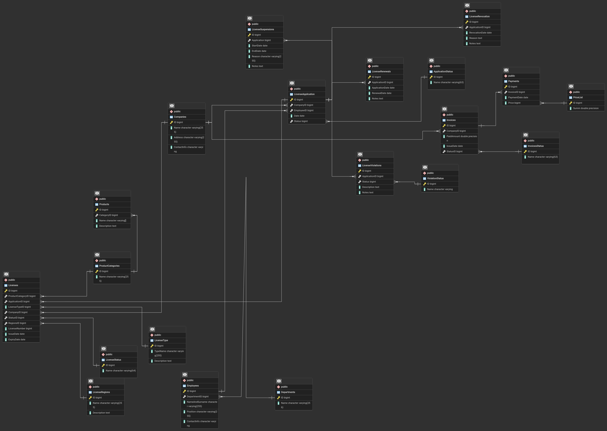

# DataManagment
Place where you can see labs for Data managment using PostgreSQL

# Схема

---

# Описание схемы
### Таблица Companies (компании):
- CompanyID (Primary Key, INT): Уникальный идентификатор компании.
- CompanyName (VARCHAR): Название компании.
- LegalAddress (VARCHAR): Юридический адрес компании.
- ContactInfo (VARCHAR): Контактная информация компании.

### Таблица Employees (сотрудники):
- EmployeeID (Primary Key, INT): Уникальный идентификатор сотрудника.
- FirstName (VARCHAR): Имя сотрудника.
- LastName (VARCHAR): Фамилия сотрудника.
- Position (VARCHAR): Должность сотрудника.
- ContactInfo (VARCHAR): Контактная информация сотрудника.

### Таблица Licenses (Лицензии):
- LicenseID (Primary Key, INT): Уникальный идентификатор лицензии.
- LicenseType (VARCHAR): Тип лицензии.
- LicenseNumber (VARCHAR): Номер лицензии.
- IssueDate (DATE): Дата выдачи лицензии.
- ExpiryDate (DATE): Дата окончания срока действия лицензии.
- Status (VARCHAR): Текущий статус лицензии.

### Таблица LicenseTypes (Тип лицензии):
- LicenseTypeID (Primary Key, INT): Уникальный идентификатор типа лицензии.
- TypeName (VARCHAR): Название типа лицензии.
- Description (TEXT): Описание типа лицензии.

### Таблица LicenseStatus (Статус лицензии):
- StatusID (Primary Key, INT): Уникальный идентификатор статуса.
- StatusName (VARCHAR): Название статуса.

### Таблица Departments (Отделы):
- DepartmentID (Primary Key, INT): Уникальный идентификатор отдела.
- DepartmentName (VARCHAR): Название отдела.

### Таблица LicenseApplications (Заявки на лицензию):
- ApplicationID (Primary Key, INT): Уникальный идентификатор заявки.
- CompanyID (Foreign Key, INT): Идентификатор компании, подающей заявку.
- EmployeeID (Foreign Key, INT): Идентификатор сотрудника, подающего заявку.
- ApplicationDate (DATE): Дата подачи заявки.
- Status (VARCHAR): Текущий статус заявки.

### Таблица ApplicationStatus (Статус заявки):
- StatusID (Primary Key, INT): Уникальный идентификатор статуса.
- StatusName (VARCHAR): Название статуса.
  
### Таблица ProductCategories (Категории продуктов):
- CategoryID (Primary Key, INT): Уникальный идентификатор категории.
- CategoryName (VARCHAR): Название категории.

### Таблица Products (Продуктов):
- ProductID (Primary Key, INT): Уникальный идентификатор продукта.
- ProductName (VARCHAR): Название продукта.
- Description (TEXT): Описание продукта.
- CategoryID (Foreign Key, INT): Идентификатор категории продукта.

### Таблица Invoices (Счета, налоги):
- InvoiceID (Primary Key, INT): Уникальный идентификатор счета.
- CompanyID (Foreign Key, INT): Идентификатор компании, которой выставлен счет.
- Amount (DECIMAL): Сумма счета.
- IssueDate (DATE): Дата выставления счета.
- Status (VARCHAR): Текущий статус счета.

### Таблица InvoiceStatus (Статус оплаты счетов, налогов):
- StatusID (Primary Key, INT): Уникальный идентификатор статуса.
- StatusName (VARCHAR): Название статуса.

### Таблица Payments (Платежи):
- PaymentID (Primary Key, INT): Уникальный идентификатор платежа.
- InvoiceID (Foreign Key, INT): Идентификатор счета, по которому произведен платеж.
- AmountPaid (DECIMAL): Сумма произведенного платежа.
- PaymentDate (DATE): Дата платежа.

### Таблица PriceList (Цены на лицензии, стоимость налогов и тд):
- PriceID (Primary Key, INT): Уникальный идентификатор цены.
- Price (DECIMAL): Цена продукта.

### Таблица LicenseRenewals (Продление лицензии):
- RenewalID (Primary Key, INT): Уникальный идентификатор продления.
- ApplicationDate (DATE): Дата подачи заявки на продление.
- RenewalDate (DATE): Дата продления лицензии.
- Notes (TEXT): Примечания по продлению.
- LicenseID (Foreign Key, INT): Идентификатор лицензии, которая продлевается.

### Таблица LicenseRevocations (Отзыв лицензии):
- RevocationID (Primary Key, INT): Уникальный идентификатор аннулирования.
- RevocationDate (DATE): Дата аннулирования.
- Reason (TEXT): Причина аннулирования.
- Notes (TEXT): Примечания по аннулированию.
- LicenseID (Foreign Key, INT): Идентификатор аннулированной лицензии.

### Таблица LicenseViolations (Нарушение лицензии):
- ViolationID (Primary Key, INT): Уникальный идентификатор нарушения.
- ViolationDate (DATE): Дата нарушения.
- Description (TEXT): Описание нарушения.
- Status (VARCHAR): Текущий статус нарушения.
- Notes (TEXT): Примечания по нарушению.
- LicenseID (Foreign Key, INT): Идентификатор лицензии, по которой зафиксировано нарушение.

### Таблица ViolationStatus (Статус нарушения) :
- StatusID (Primary Key, INT): Уникальный идентификатор статуса.
- StatusName (VARCHAR): Название статуса.

### Таблица LicenseSuspensions (Приостановка действия лицензии):
- SuspensionID (Primary Key, INT): Уникальный идентификатор приостановления.
- StartDate (DATE): Дата начала приостановления.
- EndDate (DATE): Дата окончания приостановления.
- Reason (TEXT): Причина приостановления.
- Notes (TEXT): Примечания по приостановлению.
- LicenseID (Foreign Key, INT): Идентификатор приостановленной лицензии.

### Таблица LicenseRegions (Регион(ы) на котор(ый/ые) распространен(а/ы) лицензия):
- RegionID (Primary Key, INT): Уникальный идентификатор региона.
- RegionName (VARCHAR): Название региона.
- Description (TEXT): Описание региона.
